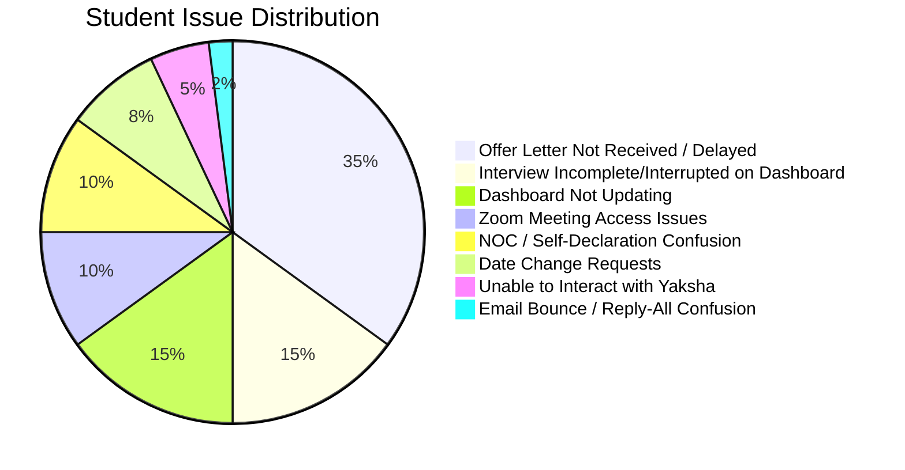
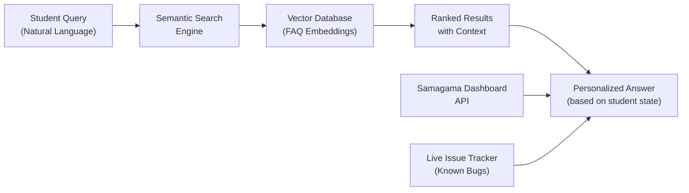
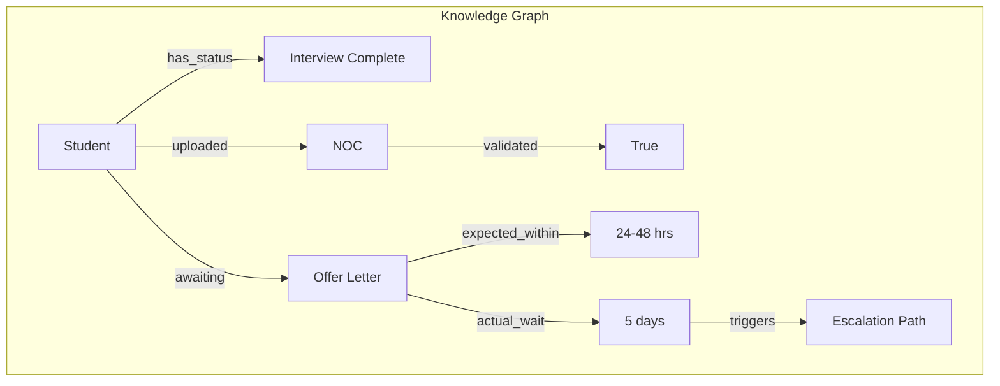
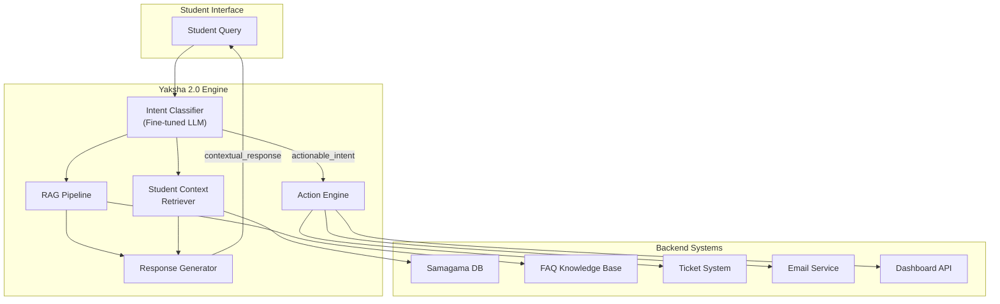
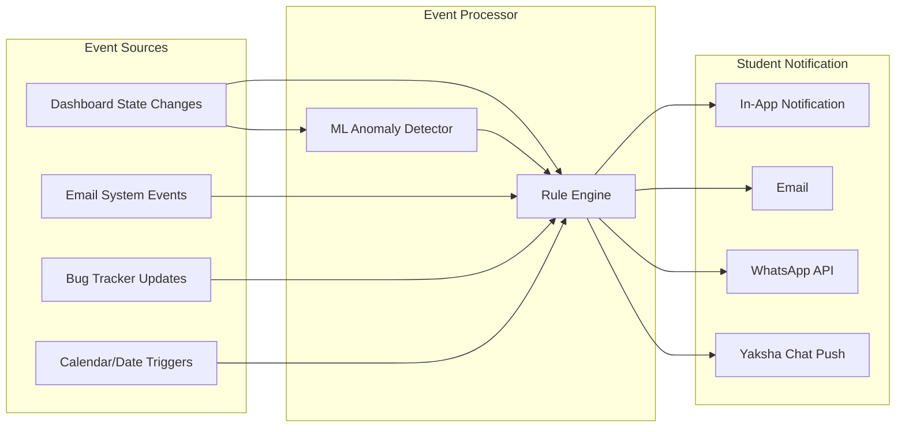
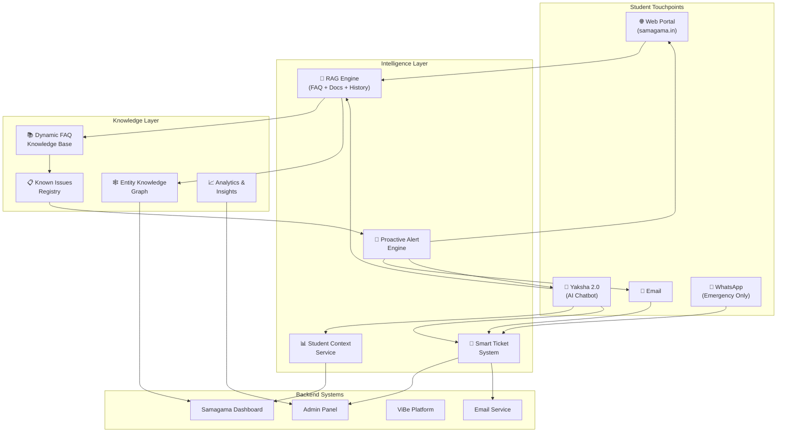

# WhatsApp Group Data Analysis & Intelligent Support Solution Framework

**Vicharanashala Summership 2026 — Troubleshoot Group**
**Analysis Period**: May 11–23, 2026 | **Data Source**: [_chat.txt](file:///Users/ravikumark/Desktop/io.sol/whatsapp_data/_chat.txt) (5,437 lines, 227 media files)

---

## 1. Executive Summary

The WhatsApp troubleshoot group for the Vicharanashala Summership 2026 reveals a **support system under severe strain**. Students are forced to use a WhatsApp group as a last resort because the two primary support channels — the static FAQ on `samagama.in` and the Yaksha chatbot — consistently fail to resolve their issues. The result is:

- A flood of **repetitive questions** that admins answer manually over and over
- Students expressing **frustration, confusion, and anxiety** about their internship status
- Admin burnout — with admins threatening Spurthi point penalties to force students out of the group
- A punitive support culture where students are penalized for seeking help

> [!CAUTION]
> The core failure is systemic: the FAQ is static and disconnected from real-time platform state, and Yaksha acts as a keyword-matching bot incapable of understanding context, leading to a **complete breakdown of self-service support**.

---

## 2. Quantitative Chat Analysis

### 2.1 Volume & Scale

| Metric | Value |
|---|---|
| Total chat lines | 5,437 |
| Date range | May 11–23, 2026 (13 days) |
| Media attachments (screenshots) | 227 files |
| Mentions of "Yaksha" | 113 |
| Mentions of "FAQ" | 287 |
| Mentions of "#escalate" | 27 |
| Mentions of "offer letter" | 292 |
| Mentions of "dashboard" | 107 |
| "Interview incomplete/interrupted" reports | 20 |
| "Not received / haven't received" complaints | 87 |
| Admin responses saying "please wait" | 36 |
| "Same problem / same issue" duplicate reports | 21 |

### 2.2 Issue Category Breakdown (from polls + message analysis)



### 2.3 Temporal Activity Pattern

Most group activity spikes during **evening sessions (6–10 PM IST)** when admins open the group for queries, creating compressed windows of chaotic parallel conversations.

---

## 3. Root-Cause Analysis: Problems with the FAQ System

### 3.1 The FAQ is Static, Not Contextual

The FAQ on `samagama.in` is structured as a traditional Q&A page with numbered sections (e.g., FAQ 2.3, FAQ 4.10, FAQ 4.16, FAQ 5.7, FAQ 6.3). However:

> [!IMPORTANT]
> **Problem**: Students read the FAQ but their specific situation is not covered because the FAQ addresses *general cases* while student issues involve *compound, context-specific states* (e.g., "I uploaded NOC 5 days ago + dashboard still shows download offer letter + I'm getting Zoom links + but no ViBe access").

**Evidence from chat**:
- `"FAQ read?(Y/N):Y"` appears in virtually every complaint — students *are* reading the FAQ but it doesn't help
- Admin repeatedly responds: `"Refer to FAQ 4.10"`, `"Read FAQ 4.16"`, `"Check FAQ 6.3"` — showing the FAQ exists but fails at self-service
- Students who cite FAQ still need human help: *"I checked the FAQ and found that changing the internship start date after receiving the offer letter requires an email from the same authority..."* — they understand the FAQ but can't act on it because their situation has exceptions

### 3.2 The FAQ Doesn't Match Platform State

The FAQ is disconnected from the live state of each student's dashboard. For example:
- FAQ says *"offer letter within 24-48 hours after NOC validation"* — but students report waiting 5+ days
- FAQ says *"use #escalate"* — but students report *"escalation did not work"* and *"no response in 48 hours"*
- FAQ says *"log out, hard refresh, log in again"* — a generic troubleshooting step that rarely fixes the actual issue

### 3.3 FAQ Has No Search or Natural Language Query Capability

Students can't describe their problem in their own words and get a relevant answer. They must browse numbered sections hoping to find relevance. This friction causes them to give up and come to WhatsApp.

### 3.4 FAQ Is Not Updated in Real-Time

When systemic issues occur (e.g., the "interview incomplete" bug), the FAQ is not updated to acknowledge it. Admins resort to posting workarounds in the WhatsApp group instead:
- *"This is a prevalent issue which is being worked on"*
- *"It's a technical glitch, dw"*
- *"Before 15 June it will be updated. Don't panic."*

These are ad-hoc announcements that never make it back into the FAQ.

---

## 4. Root-Cause Analysis: Problems with the Yaksha Chatbot

### 4.1 Yaksha Cannot Resolve Actual Issues

Yaksha functions as an **informational relay**, not a problem-solver. It can:
- ✅ Tell students their interview is complete
- ❌ Actually fix the dashboard showing "Interview Incomplete"
- ❌ Trigger backend processes (issue offer letter, update status)
- ❌ Provide personalized status updates based on the student's actual state

**Critical evidence**:
> *"I successfully completed my interview, and the chatbot also confirmed that my interview was completed successfully. However, my dashboard is still showing the interview status as 'Incomplete.'"* — reported by **at least 6 different students**

> *"The chatbot responded that my interview is fully recorded and complete and that the incomplete status is only a technical dashboard issue. The response also mentioned that the issue has been escalated again and that the team is actively working on it."*

Yaksha **tells students the right thing** but **cannot act on it**. This creates a deeply frustrating experience — the bot acknowledges the problem exists but is powerless to fix it.

### 4.2 Yaksha's #Escalate Mechanism is a Black Hole

The `#escalate` command is supposed to route issues to human agents. In practice:

| Escalation Evidence | Outcome |
|---|---|
| *"I have escalated already in the yaksha chat. However I didn't get any response in 48 hours."* | No response |
| *"I also tried to raise this issue through the Yaksha chat using #escalate, but the escalation did not work."* | Escalation failed |
| *"Already Escalated but still not received"* | No action taken |
| *"Has escalated a issue been more than 1 and half a day still no reply from team"* | No reply |
| *"Escalated the issue but no response"* | Repeated pattern |
| *"I asked my issue to Yaksha, but I haven't received any reply. Then, I escalated my message to the team, but I still haven't received anything."* | Complete failure |

> [!WARNING]
> **The #escalate feature appears to be a dead-end**: students type it, Yaksha acknowledges it, but no one picks up the ticket. There is no visible ticketing system, no status tracking, and no SLA enforcement.

### 4.3 Yaksha's UI/UX Issues

Multiple students report they **cannot even interact with Yaksha**:
- *"Unable to interact, the platform doesn't allow to send any msg to yaksha"*
- *"Why am I not able to chat with yaksha?"*
- *"Your platform isn't allowing to msg yaksha"*
- *"Unable to interact with yaksha to declare the internship request"*
- *"My Yaksha portal has been behaving as it was during interview [like switching tab goes to queue, and 15s silence gives warning]"*

The chat interface appears to enter a **locked/disabled state** that students cannot exit without admin intervention (requiring them to "scroll up and click 'interact with yaksha'").

### 4.4 Yaksha Gives Conflicting or Misleading Information

- Yaksha confirmed an interview was complete → Dashboard showed "Interrupted" → Student was confused
- Yaksha suggested picking "any convenient dates" for internship → Students later penalized for wrong dates
- Yaksha told students they could log out → Dashboard then showed "Interview Interrupted"

---

## 5. Taxonomy of Recurring Student Issues

Based on comprehensive analysis, the **top 8 recurring issue clusters** are:

### 5.1 🔴 Offer Letter Not Received (35% of issues)
- Students complete all steps but offer letter doesn't appear
- FAQ states 24-48 hours; students report waiting 5+ days
- Students asking *"when will I get my offer letter?"* constitutes the single largest complaint category

### 5.2 🔴 Interview Status Bug (15%)
- Dashboard shows "Interview Incomplete" or "Interview Interrupted" despite successful completion
- Yaksha confirms completion but dashboard disagrees
- Known backend bug that admins acknowledge but cannot fix from WhatsApp

### 5.3 🟠 Dashboard Not Updating (15%)
- Steps completed on one end not reflected on dashboard
- Signed offer letter sent but dashboard stuck at "Download Offer Letter"
- NOC uploaded but status shows "NOC Pending"

### 5.4 🟠 Zoom Meeting Access (10%)
- Registration errors, passcode issues
- "Host has locked the meeting" — student locked out after brief disconnect
- Not receiving meeting links via email (only via dashboard announcements)

### 5.5 🟡 NOC / Self-Declaration Confusion (10%)
- Confusion about when to use self-declaration vs NOC
- NOC uploaded but offer letter still says "provisional based on self-declaration"
- Students uploading NOC *after* self-declaration causing state conflicts

### 5.6 🟡 Date Change Requests (8%)
- Students needing to change internship dates due to exams
- Complex process requiring NOC authority email — confusing for students
- Locked dates on dashboard with no self-service change option

### 5.7 🟡 Email Reply Issues (2%)
- "Reply All" vs "Reply" confusion when sending signed offer letter
- No-reply@vicharanashala.ai bouncing — "address not found" error
- Students unsure if their email was received (no confirmation)

### 5.8 🟡 General Process Confusion
- What to do on day 1 of internship
- Where to find course links (ViBe)
- Whether to attend meetings before official start date
- How Spurthi points work

---

## 6. Technology-Driven Solutions

### 6.1 Dynamic, Contextual FAQ System

#### Replace Static FAQ with a Knowledge-Aware Help Center



**Key Components**:

| Component | Technology | Purpose |
|---|---|---|
| **Semantic Search** | Vector embeddings (OpenAI/Cohere) + Pinecone/Weaviate | Allow students to ask questions in natural language instead of browsing numbered FAQ sections |
| **Personalized Context** | Dashboard API integration | Show answers relevant to the student's *actual* state (e.g., if their NOC is validated, don't show NOC-related FAQs) |
| **Live Issue Awareness** | Real-time bug/status feed | When a known issue exists (like the "interview incomplete" bug), surface it proactively: *"We're aware of this issue and actively working on it. No action needed from your side."* |
| **Auto-updating Content** | Admin annotation system | When admins post a workaround in WhatsApp, a tool should let them instantly add it to the FAQ with one click |

#### Contextual Search with Knowledge Graphs



A knowledge graph models **relationships between entities** (student, documents, statuses, processes) enabling:
- **Intelligent routing**: If a student's NOC is validated but offer letter is delayed beyond 48 hrs → auto-escalate
- **Proactive answers**: Before the student even asks, the system knows their offer letter is overdue
- **Disambiguation**: When a student says "I haven't received anything," the graph determines *what* they're missing based on their progress state

---

### 6.2 Intelligent Yaksha 2.0 — Context-Aware Student Support Bot

#### Architecture: RAG-Powered Conversational Agent



#### Key Capabilities vs. Current Yaksha

| Capability | Current Yaksha | Yaksha 2.0 |
|---|---|---|
| **Understand natural language** | ❌ Keyword matching | ✅ LLM-powered intent understanding |
| **Know student's current state** | ❌ No context | ✅ Pulls live dashboard data per student |
| **Actually resolve issues** | ❌ Can only suggest FAQ | ✅ Can trigger backend actions (recheck status, reissue letter) |
| **Track escalations** | ❌ Black hole #escalate | ✅ Creates trackable ticket with SLA, status visible to student |
| **Handle known bugs** | ❌ Generic responses | ✅ Recognizes known issues and provides specific ETA |
| **Multi-turn conversation** | ❌ Stateless | ✅ Maintains conversation context across sessions |
| **Proactive notifications** | ❌ None | ✅ Pushes updates when student's issue is resolved |
| **Handoff to human** | ❌ Broken | ✅ Seamless escalation with full context transfer |

#### Example: Reimagined Student Interaction

**Current Experience (broken)**:
```
Student: My interview shows incomplete but I completed it
Yaksha: Your interview is complete. Please wait 24 hours 
        and use #escalate if issue persists.
[Student waits 48 hours]
Student: #escalate
Yaksha: Your issue has been escalated.
[No response ever comes]
[Student joins WhatsApp group in frustration]
```

**Yaksha 2.0 Experience**:
```
Student: My interview shows incomplete but I completed it
Yaksha 2.0: Hi Tarang! I can see your interview was 
  completed on May 14 at 3:42 PM. ✅
  
  Your dashboard is showing "Incomplete" due to a known 
  sync issue affecting ~40 students. Our engineering team 
  deployed a fix at 2:00 PM today.
  
  🔄 Let me check your status right now...
  
  ✅ Your interview records are intact and properly saved.
  ⏳ Dashboard sync is queued — expected update within 
     2 hours.
  
  I've created ticket #TSR-2026-0847 for your case. 
  You'll get a notification here when it's resolved.
  
  Meanwhile, you can proceed with the next steps — 
  this won't affect your onboarding. Need anything else?
```

---

### 6.3 Proactive Student Support System

Instead of waiting for students to discover problems and seek help, the system should **detect and communicate issues proactively**:

#### Trigger-Based Notification Engine

| Trigger Condition | Action |
|---|---|
| NOC uploaded > 48 hrs + no offer letter | Auto-notify student: "We're processing your NOC. Expected offer letter by [date]" |
| Interview completed but dashboard says incomplete | Auto-create ticket + notify student about known issue |
| Internship start date is tomorrow + no Zoom link sent | Auto-send Zoom link + welcome email |
| Signed offer letter email received | Auto-confirm: "We received your signed offer letter ✅" |
| Student's Spurthi points dropping | Personalized alert with reason and guidance |
| Known system bug affecting student | Proactive notification: "You may notice [issue]. No action needed." |

#### Implementation: Event-Driven Architecture



---

### 6.4 Ticketing & Issue Tracking System

The current system has **zero issue tracking**. Students report issues, admins say "noted, please wait" — and there's no system ensuring follow-through.

#### Proposed Ticket Lifecycle

```mermaid
stateDiagram-v2
    [*] --> Created: Student reports issue
    Created --> AutoResolved: Known issue / auto-fix available
    Created --> Triaged: AI categorization + priority assignment
    Triaged --> InProgress: Assigned to team member
    InProgress --> WaitingInfo: Need student input
    WaitingInfo --> InProgress: Student responds
    InProgress --> Resolved: Issue fixed
    Resolved --> Closed: Student confirms
    AutoResolved --> Closed: Auto-confirmed after 24h
    
    note right of Created: Visible to student\nwith status updates
    note right of Triaged: SLA timer starts\nPriority: P1 (4h) / P2 (24h) / P3 (48h)
```

#### SLA Recommendations

| Priority | Description | Response SLA | Resolution SLA |
|---|---|---|---|
| **P1 - Critical** | Internship starts today/tomorrow, blocking issue | 1 hour | 4 hours |
| **P2 - High** | Issue blocking progress, start date within 3 days | 4 hours | 24 hours |
| **P3 - Medium** | Issue not blocking, start date >3 days away | 12 hours | 48 hours |
| **P4 - Low** | Information request, general query | 24 hours | 72 hours |

---

## 7. Solution Framework: Intelligent Student Support Platform (ISSP)

### 7.1 Architecture Overview



### 7.2 Key Design Principles

1. **Context-First**: Every interaction should know who the student is and what their current state is before responding
2. **Self-Service Priority**: 80% of queries should be resolvable without human intervention
3. **Transparent Tracking**: Every issue gets a visible ticket number with status updates
4. **Proactive > Reactive**: Detect and communicate issues before students discover them
5. **Continuous Learning**: Every WhatsApp conversation that "should have been" handled by the bot gets fed back into training data
6. **Empathetic Tone**: Replace the current punitive tone ("your SP will be deducted") with supportive communication

### 7.3 Technology Stack Recommendations

| Layer | Technology | Justification |
|---|---|---|
| **LLM / NLP** | GPT-4o / Claude / Gemini (via API) | Natural language understanding, response generation, intent classification |
| **RAG Framework** | LangChain + LlamaIndex | Orchestrate retrieval from FAQ, docs, and knowledge graph |
| **Vector DB** | Pinecone / Weaviate / Qdrant | Semantic search over FAQ content and historical resolutions |
| **Knowledge Graph** | Neo4j / Amazon Neptune | Model student-process-status relationships for contextual reasoning |
| **Ticket System** | Custom (or Freshdesk/Zendesk API) | Issue tracking with SLA enforcement and student-facing portal |
| **Notification Engine** | Apache Kafka + custom rules engine | Event-driven proactive notifications |
| **Analytics** | Metabase / Grafana | Track resolution times, common issues, bot deflection rates |
| **WhatsApp Integration** | WhatsApp Business API (official) | For emergency escalation only, with automated intake |

---

## 8. Implementation Roadmap

### Phase 1: Quick Wins (1–2 weeks)

- [ ] **Add semantic search to FAQ page** — Let students type their question in natural language
- [ ] **Create a "Known Issues" banner on the dashboard** — When a systemic bug exists, show it to affected students
- [ ] **Fix Yaksha's #escalate mechanism** — Ensure escalations create trackable tickets with status visibility
- [ ] **Add email confirmation** — When a student sends their signed offer letter, auto-reply with "Received ✅"
- [ ] **Build a simple FAQ bot** — Even a rule-based bot that answers the top 10 questions would deflect 40% of WhatsApp traffic

### Phase 2: Medium-Term (1–2 months)

- [ ] **Deploy Yaksha 2.0 with RAG** — Context-aware responses pulling from FAQ + student dashboard state
- [ ] **Implement proactive notifications** — Alert students about their own issues before they ask
- [ ] **Build student-facing ticket portal** — Every #escalate creates a visible ticket with status tracking
- [ ] **Integrate Yaksha with backend APIs** — Allow bot to trigger status refreshes, recheck processes
- [ ] **Admin dashboard for support analytics** — Track resolution times, common issues, bot performance

### Phase 3: Long-Term (3–6 months)

- [ ] **Knowledge graph deployment** — Model all student-process relationships for intelligent reasoning
- [ ] **Continuous learning pipeline** — Feed resolved WhatsApp conversations back into bot training
- [ ] **Predictive support** — ML models that predict which students will face issues based on their progress pattern
- [ ] **Multi-channel unified inbox** — Single admin view for queries from Yaksha, email, and WhatsApp
- [ ] **Student satisfaction surveys** — Measure NPS after each support interaction

---

## 9. Success Metrics & KPIs

| Metric | Current State (Estimated) | Target |
|---|---|---|
| **FAQ self-service resolution rate** | <10% | >60% |
| **Yaksha bot deflection rate** | ~5% (most issues escalate to WhatsApp) | >70% |
| **Average issue resolution time** | 48–120 hours (or never) | P1: 4h, P2: 24h, P3: 48h |
| **Repeat query rate** (same student, same issue) | ~40% | <10% |
| **WhatsApp group message volume** | ~400 messages/day | <50 messages/day |
| **Student satisfaction with support** | Very Low (inferred from frustration) | >4.0/5.0 |
| **Escalation-to-resolution rate** | ~20% (most escalations go unanswered) | >95% |
| **Proactive issue detection rate** | 0% | >50% of known issues communicated proactively |

---

## 10. Key Recommendations Summary

> [!TIP]
> **Highest-Impact, Lowest-Effort Actions**:
> 1. Fix the #escalate black hole — even a simple Google Form → Sheet pipeline is better than nothing
> 2. Add a "Known Issues" section to the dashboard — eliminates 30%+ of WhatsApp queries instantly
> 3. Send auto-confirmation emails when students submit documents — eliminates the "did my email arrive?" anxiety

> [!IMPORTANT]
> **Cultural Shift Needed**: The current support model is **punitive** (SP point deductions for staying in the group, threats of removal). This drives students away from seeking help. The new model should be **supportive** — making help so easy to get through self-service that students don't *need* to stay in WhatsApp.

> [!WARNING]
> **Without these changes**, the WhatsApp group will continue to be overwhelmed. With each new batch of interns (~100+ per cycle), the manual admin workload will scale linearly while student satisfaction drops. The Yaksha bot in its current form is **actively harming the student experience** by creating false confidence (confirming issues are resolved when they aren't) and providing a non-functional escalation path.

---

*Analysis generated from 5,437 lines of WhatsApp chat data, 227 screenshot attachments, covering 13 days of student support interactions across 100+ unique participants.*
